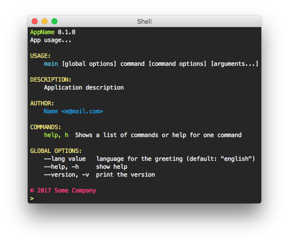

# ccli 🌈
[](https://travis-ci.org/saschagrunert/ccli) [](https://godoc.org/gopkg.in/saschagrunert/ccli.v1) [](http://gopkg.in/saschagrunert/ccli.v1)
## Command line parsing in go, with coloring support

This project uses the already existing go package [cli](https://github.com/urfave/cli) and adds additional coloring
support to it. Some strong defaults are provided as well.



## Usage
Install the package with:

```shell
go get github.com/saschagrunert/ccli
```

Afterwards it can be used like the `cli` package:

```go
package main

import (
	"fmt"
	"github.com/saschagrunert/ccli"
	"github.com/urfave/cli"
	"os"
	"time"
)

func main() {
	app := ccli.NewApp()
	app.Name = "AppName"
	app.Usage = "App usage..."
	app.Version = "0.1.0"
	app.Description = "Application description"
	app.Copyright = fmt.Sprintf("© %d Some Company", time.Now().Year())
	app.Authors = []cli.Author{cli.Author{Name: "Name", Email: "e@mail.com"}}
	app.Flags = []cli.Flag{
		cli.StringFlag{
			Name:  "lang",
			Value: "english",
			Usage: "language for the greeting",
		},
	}
	app.Action = func(c *cli.Context) error {
		fmt.Println("boom! I say!")
		return nil
	}
	app.Run(os.Args)
}
```
