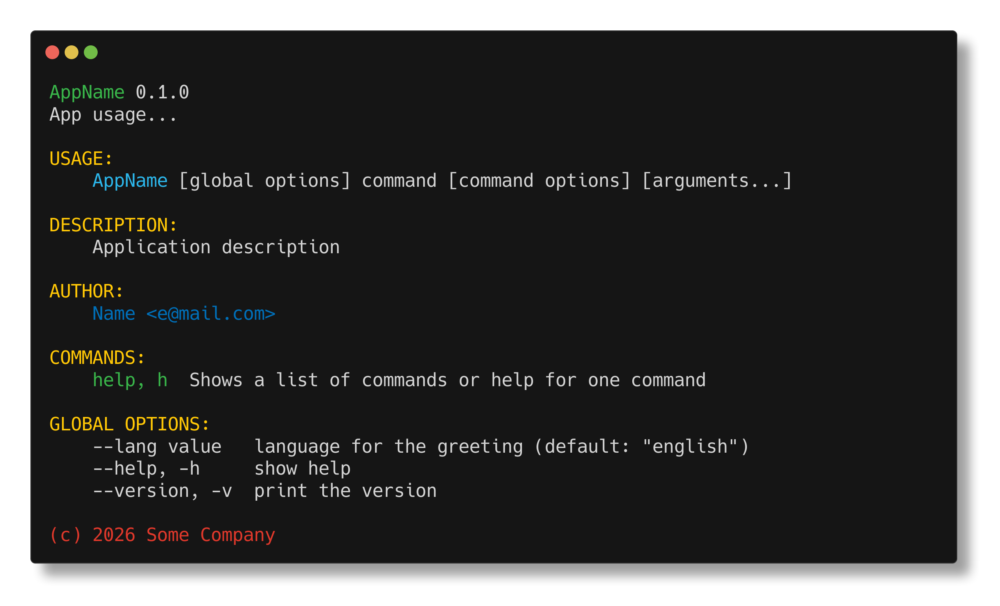

# ccli

[](https://github.com/saschagrunert/ccli/actions/workflows/ci.yml)
[](https://pkg.go.dev/github.com/saschagrunert/ccli/v3)

## Command line parsing in Go, with coloring support

This package wraps [urfave/cli/v3](https://github.com/urfave/cli) and adds
coloring to help output. Section headers, command names, author info, and
copyright each get their own color.



## Usage

Install the package with:

```shell
go get github.com/saschagrunert/ccli/v3
```

Then use it like the `cli` package:

```go
package main

import (
	"context"
	"fmt"
	"os"
	"time"

	"github.com/saschagrunert/ccli/v3"
	"github.com/urfave/cli/v3"
)

func main() {
	cmd := ccli.NewCommand()
	cmd.Name = "AppName"
	cmd.Usage = "App usage..."
	cmd.Version = "0.1.0"
	cmd.Description = "Application description"
	cmd.Copyright = fmt.Sprintf("(c) %d Some Company", time.Now().Year())
	cmd.Authors = []any{"Name <e@mail.com>"}
	cmd.Flags = []cli.Flag{
		&cli.StringFlag{
			Name:  "lang",
			Value: "english",
			Usage: "language for the greeting",
		},
	}
	cmd.Action = func(_ context.Context, _ *cli.Command) error {
		fmt.Println("boom! I say!")
		return nil
	}
	if err := cmd.Run(context.Background(), os.Args); err != nil {
		os.Exit(1)
	}
}
```

## Custom colors

Use functional options with `NewCommandWith`:

```go
import (
	"github.com/fatih/color"
	"github.com/saschagrunert/ccli/v3"
)

cmd := ccli.NewCommandWith(
	ccli.WithGreen(color.New(color.FgHiGreen).SprintFunc()),
	ccli.WithYellow(color.New(color.FgHiYellow).SprintFunc()),
)
```

Or pass an `Options` struct to `NewCommandWithOptions`:

```go
cmd := ccli.NewCommandWithOptions(ccli.Options{
	Green:  color.New(color.FgHiGreen).SprintFunc(),
	Yellow: color.New(color.FgHiYellow).SprintFunc(),
})
```

Any color left unset falls back to its default. To turn off all coloring:

```go
cmd := ccli.NewCommandWith(ccli.WithDisable())
```

## Migrating from v2

The `v2` branch is deprecated. To upgrade, change your imports from
`github.com/saschagrunert/ccli/v2` to `github.com/saschagrunert/ccli/v3` and
follow the [urfave/cli v3 migration guide](https://github.com/urfave/cli/blob/main/docs/migrate-v2-to-v3.md).
The main change is that `cli.App` has been replaced by `cli.Command`, so
`NewApp` is now `NewCommand`.

## Notes

All help templates are set per-command via `CustomRootCommandHelpTemplate`
and `CustomHelpTemplate`. No package-level globals are modified.

## License

[MIT](LICENSE)
